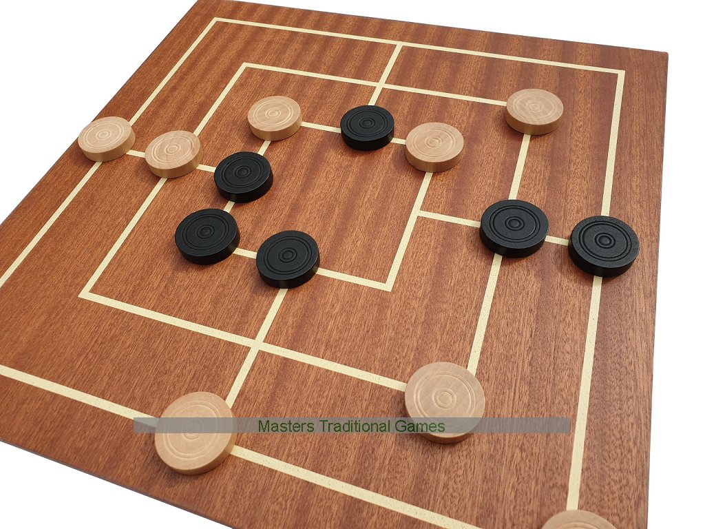

# AI-Nine-Men-s-Morris-player
Implementation of a Nine Men's Morris player using artificial Intelligence techniques:
Developed with an iterative deepening (limited in time) research strategy based on the Min-Max algorithm (and alpha beta pruning).
Implementation of a complex heuristic to make the player as intelligently as possible.

